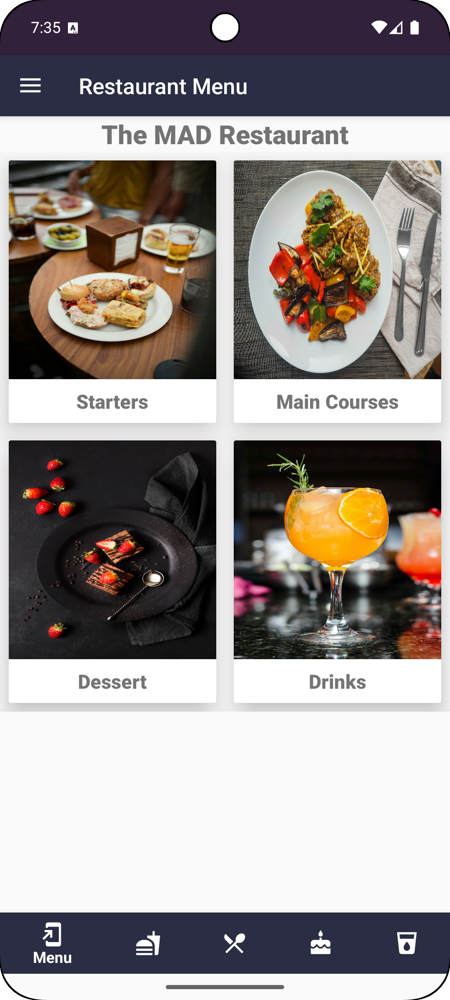
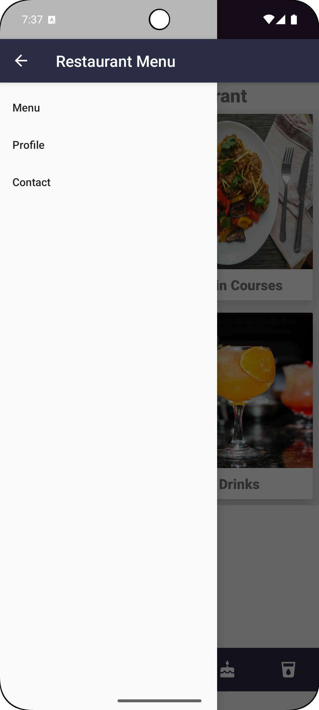
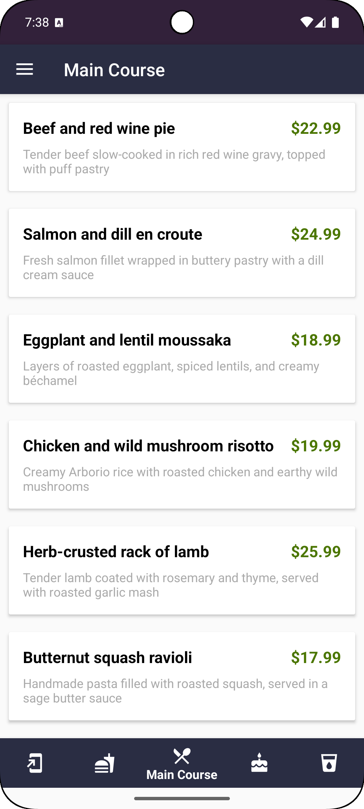
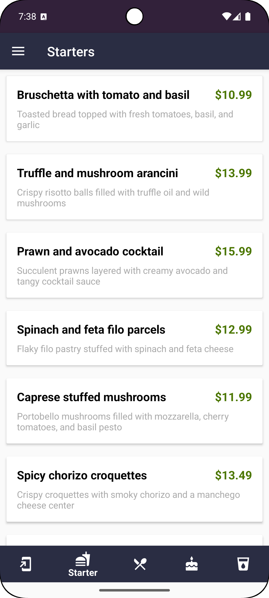
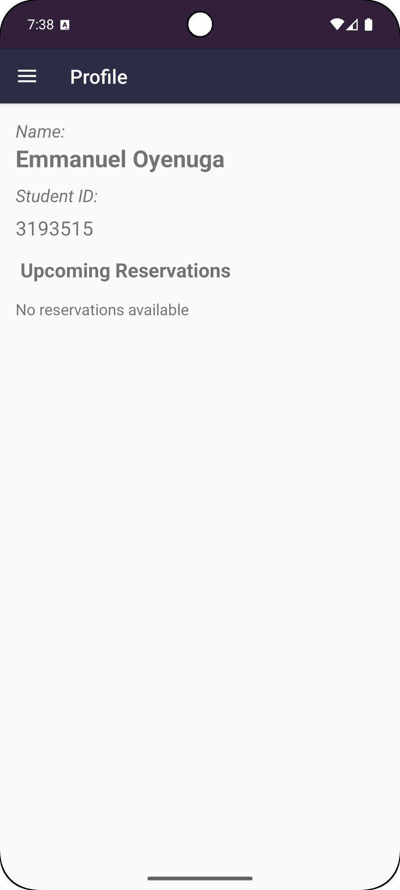
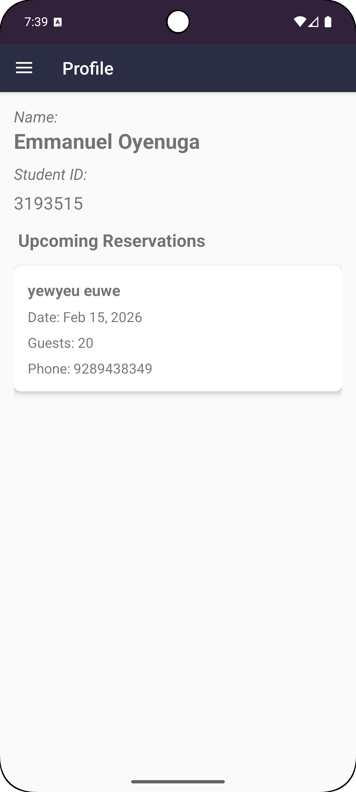
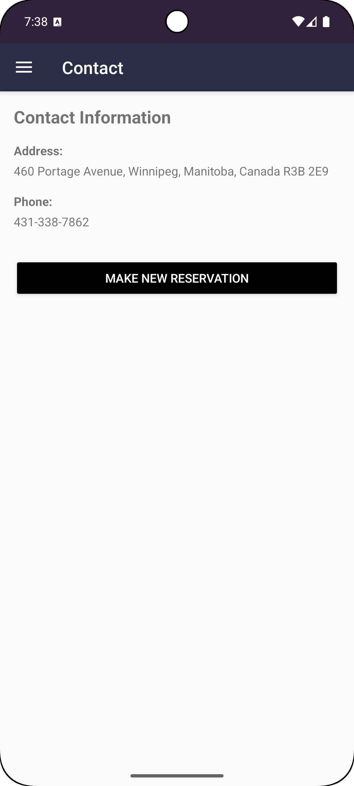
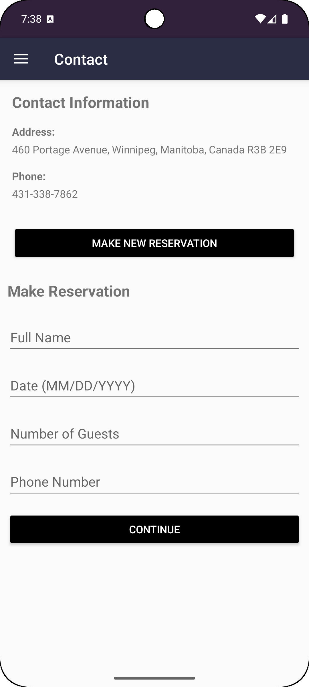
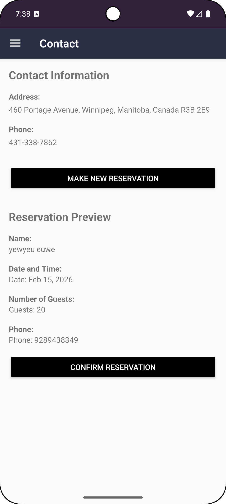

# Restaurant Menu and Reservation App (Android + Room Database)

This Android application allows users to browse a restaurants menu and place reservations. It is built using **Room Database**. It is built with **Kotlin**, **DAO interfaces**, and the **MVVM architecture**, ensuring clean data flow and offline-first functionality.

---

## 🍲 Features

- Add new reservation
- Edit and delete existing items
- Manage reservation history
- DAO-based CRUD operations
- MVVM architecture with ViewModel + LiveData
- Simple, clean XML UI
- RecyclerView for listing menus

---

## 🛠️ Tech Stack

| Component | Technology |
|----------|------------|
| Language | Kotlin |
| Local Storage | Room Database |
| Data Access | DAO Interfaces |
| Architecture | MVVM |
| UI | XML Layouts |
| Reactive Updates | LiveData / ViewModel |

---
## 📱 App Screenshots

### Reservation Home

<table>
  <tr>
    <td></td>
    <td></td>
  </tr>
</table>

### Menu Items

<table>
  <tr>
    <td></td>
    <td></td>
    <td></td>
    <td></td>
  </tr>
</table>

## Profile and Reservations

<table>
  <tr>
    <td></td>
    <td></td>
    <td></td>
    <td></td>
    <td></td>
  </tr>
</table>

## 👤 Developer

**Emmanuel Oyenuga**  
Mobile App Developer – Winnipeg, MB  
